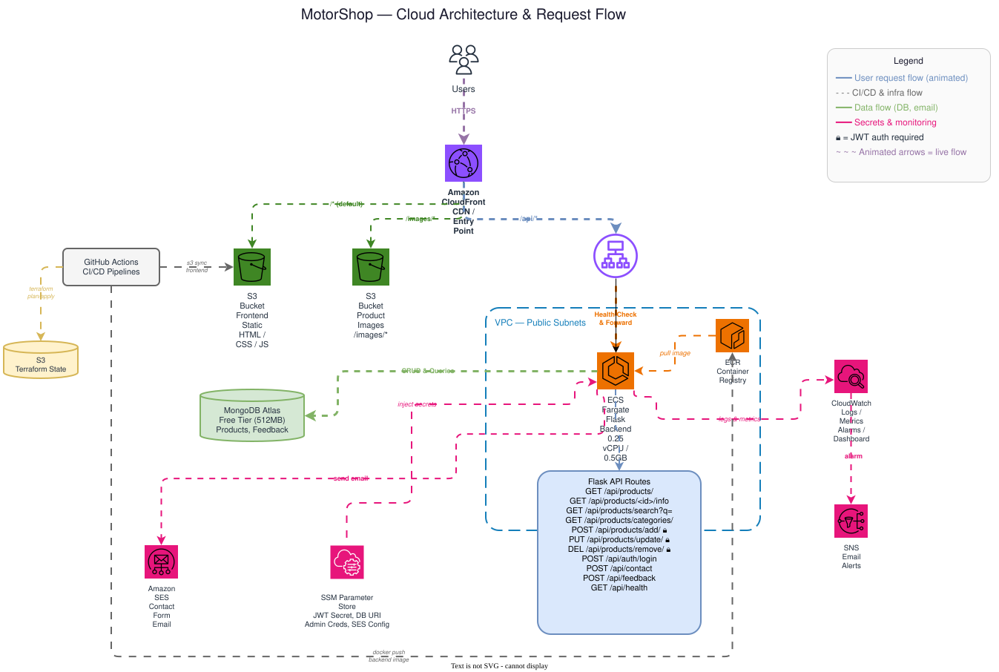

# Motor Shop

A full-stack e-commerce web application for a Vietnamese motorcycle parts and accessories store. Customers can browse a product catalogue, filter by category, search products, and view individual product detail pages. Runs locally with Docker Compose and deploys to AWS with Terraform (ECS Fargate + CloudFront + S3).

---

## Architecture



### Local Development (Docker Compose)

```
Browser
  └─► Nginx :8000
        ├─ /                → static files  (HTML / CSS / JS)
        ├─ /product/<id>    → product detail page (product_info.html)
        ├─ /api/            → reverse proxy → Flask :5000
        └─ /images/         → reverse proxy → MinIO :9000
```

All four services share a single Docker bridge network (`backend_network`). MinIO and MongoDB are not exposed to the host.

### AWS Production

```
Browser
  └─► CloudFront
        ├─ /                → S3 (frontend static files)
        ├─ /images/         → S3 (product images, prefix stripped by CF function)
        └─ /api/            → ALB → ECS Fargate (Flask backend)
                                       └─► MongoDB Atlas
```

| AWS Service   | Purpose                                         |
|---------------|-------------------------------------------------|
| CloudFront    | CDN — routes to S3 origins and ALB backend      |
| S3            | Frontend static files + product images           |
| ECS Fargate   | Runs the Flask backend container                 |
| ECR           | Docker image registry for the backend            |
| ALB           | Application Load Balancer in front of ECS        |
| SSM Parameter Store | Stores secrets (DB creds, JWT, admin login) |
| VPC           | Networking — 2 public subnets across 2 AZs       |
| CloudWatch    | Structured JSON logs from ECS tasks              |

---

## Features

- Product listing page with category sidebar and pagination
- Individual product detail pages with dynamic routing (`/product/<id>`)
- Product search by name or category
- Contact form with email support (AWS SES in production)
- Customer feedback/review submission with star ratings
- JWT-authenticated admin CRUD operations (add, update, remove products)
- REST API backed by Flask and MongoDB
- Structured JSON logging for CloudWatch compatibility
- Dual MongoDB support: local Docker instance or MongoDB Atlas (production)
- Infrastructure as Code with Terraform (modular AWS deployment)
- CloudFront CDN with S3 origins and ALB backend routing
- Health checks on MongoDB and MinIO with service dependency ordering
- Comprehensive test suite (29 tests) with pytest

---

## Tech Stack

| Layer          | Technology                                          |
|----------------|-----------------------------------------------------|
| Frontend       | HTML / CSS / Vanilla JavaScript                     |
| Web server     | Nginx 1.27 (Alpine) — local dev only                |
| Backend        | Python 3.12, Flask 3.x, flask-pymongo, PyJWT, boto3 |
| Database       | MongoDB 7.0 (local) / MongoDB Atlas (production)    |
| Object store   | MinIO (local) / S3 (production)                     |
| CDN            | CloudFront (production)                             |
| Compute        | ECS Fargate (production)                            |
| IaC            | Terraform (AWS provider 6.55)                       |
| Testing        | pytest, mongomock                                   |
| Linting        | ruff                                                |
| Packaging      | [uv](https://github.com/astral-sh/uv)              |
| Containers     | Docker & Docker Compose                             |

---

## Project Structure

```
motorShop/
├── docker-compose.yml
├── .env                          # Credentials (not committed)
├── .env.example                  # Template for required env vars
│
├── backend/
│   ├── app/
│   │   ├── __init__.py           # App factory — PyMongo init, blueprint registration
│   │   ├── middleware.py         # JWT @token_required decorator
│   │   ├── logging_config.py    # Structured JSON log formatter
│   │   ├── main/                 # Main blueprint  →  GET /
│   │   ├── products/             # Products blueprint  →  /api/products/
│   │   ├── auth/                 # Auth blueprint  →  POST /api/auth/login
│   │   ├── contact/              # Contact blueprint  →  POST /api/contact
│   │   ├── feedback/             # Feedback blueprint  →  POST /api/feedback
│   │   └── health/               # Health blueprint  →  GET /api/health
│   ├── tests/
│   │   ├── conftest.py           # Shared test fixtures (app, client, mock db)
│   │   ├── test_routes.py        # Product listing/detail/category tests
│   │   ├── test_products_crud.py # CRUD endpoint tests
│   │   ├── test_search.py        # Search endpoint tests
│   │   ├── test_auth.py          # JWT auth tests
│   │   ├── test_contact.py       # Contact form tests
│   │   ├── test_feedback.py      # Feedback submission tests
│   │   └── test_health.py        # Health check tests
│   ├── pyproject.toml            # Dependencies (Flask, PyJWT, boto3, pytest, ruff)
│   └── ruff.toml                 # Linter/formatter config
│
├── frontend/
│   ├── index.html                # Product listing page
│   ├── nginx.conf                # Nginx routing + reverse proxy (local dev)
│   ├── assets/                   # Icons, banners, placeholder images
│   ├── css/
│   │   ├── main.css              # Shared styles (header, footer, grid, menu)
│   │   ├── pages.css             # Blog, contact, feedback page styles
│   │   └── product_info.css      # Product detail page styles
│   ├── js/
│   │   ├── main.js               # Listing page — fetch products, render, paginate
│   │   └── product_info.js       # Detail page — read URL slug, fetch & render product
│   └── pages/
│       ├── product_info.html     # Product detail page
│       ├── blog.html             # Blog page
│       ├── contact.html          # Contact form page
│       └── feedback.html         # Feedback/review page
│
├── docs/
│   └── motorshop-architecture-flow.svg   # Architecture diagram
│
└── infra/
    ├── Dockerfile/
    │   ├── frontend/
    │   │   └── Dockerfile        # Nginx image — copies frontend/ into container
    │   ├── mongodb/
    │   │   ├── Dockerfile
    │   │   ├── mongo-init.sh     # Runs mongoimport on first start
    │   │   └── products.json     # Seed data — 9 products
    │   ├── minio/
    │   │   ├── Dockerfile
    │   │   ├── minio-init.sh     # Creates bucket, sets public read, seeds images
    │   │   └── product/          # Product images bind-mounted at runtime
    │   └── service/
    │       └── Dockerfile        # Flask service — python:3.12-slim + uv + gunicorn
    │
    └── terraform/
        ├── main.tf               # Root module — wires all child modules
        ├── variables.tf          # Input variables (region, secrets, etc.)
        ├── output.tf             # Exported outputs (URLs, IDs, ARNs)
        ├── terraform.tfvars.example
        ├── bootstrap/            # One-time S3 state bucket setup
        │   ├── main.tf
        │   ├── variable.tf
        │   └── output.tf
        └── modules/
            ├── networking/       # VPC, subnets, IGW, route tables, security groups
            ├── ecr/              # Container registry + lifecycle policy
            ├── ecs/              # Cluster, task definition, service, ALB, target group
            ├── s3/               # Frontend + product-images buckets
            ├── cloudfront/       # Distribution with S3 + ALB origins, OAC, CF function
            ├── iam/              # Task execution role, task role, policies
            └── ssm/              # SecureString parameters for secrets
```

---

## Services & Ports (Local)

| Service           | Container  | Host port | Description                           |
|-------------------|------------|-----------|---------------------------------------|
| `frontend`        | `frontend` | `8000`    | Nginx — serves UI and proxies traffic |
| `backend_service` | `backend`  | `5000`    | Flask REST API (gunicorn)             |
| `mongodb`         | `mongodb`  | —         | MongoDB (internal only)               |
| `minio`           | `minio`    | —         | Object storage (internal only)        |

---

## API Endpoints

Base URL: `http://localhost:5000` (direct) or `http://localhost:8000/api/` (via Nginx)

### Public Endpoints

| Method | Path                              | Description                      |
|--------|-----------------------------------|----------------------------------|
| `GET`  | `/`                               | Main blueprint health check      |
| `GET`  | `/api/health`                     | ALB health check                 |
| `GET`  | `/api/products/`                  | List all products                |
| `GET`  | `/api/products/categories/`       | List distinct categories         |
| `GET`  | `/api/products/<product_id>/info` | Get a single product by ID       |
| `GET`  | `/api/products/search?q=<query>`  | Search products by name/category |
| `POST` | `/api/auth/login`                 | Admin login — returns JWT token  |
| `POST` | `/api/contact`                    | Submit contact form              |
| `POST` | `/api/feedback`                   | Submit feedback with star rating |

### Protected Endpoints (require JWT)

| Method   | Path                     | Description            |
|----------|--------------------------|------------------------|
| `POST`   | `/api/products/add/`     | Add a new product      |
| `PUT`    | `/api/products/update/`  | Update a product       |
| `DELETE` | `/api/products/remove/`  | Remove a product       |

Protected endpoints require an `Authorization: Bearer <token>` header. Obtain a token via `POST /api/auth/login`.

---

## Getting Started

### Prerequisites

- [Docker](https://docs.docker.com/get-docker/) and [Docker Compose](https://docs.docker.com/compose/)
- A `.env` file in the project root (see [Environment Variables](#environment-variables))

### Option 1 — Docker Compose (recommended for local dev)

```bash
cp .env.example .env
# Edit .env and fill in all values
docker compose up --build
```

| URL                     | What you see           |
|-------------------------|------------------------|
| `http://localhost:8000` | Shop frontend          |
| `http://localhost:5000` | Flask API (direct)     |

To tear down and remove all volumes:

```bash
docker compose down -v
```

### Option 2 — Local development (backend only)

Requires a running MongoDB instance on `localhost:27017`.

```bash
cd backend
pip install uv
uv sync
# Set required env vars
export MONGO_ROOT_USERNAME=your_user
export MONGO_ROOT_PASSWORD=your_password
export MONGODB_HOST=localhost:27017
export JWT_SECRET=your-secret-key-at-least-32-bytes
export ADMIN_USERNAME=admin
export ADMIN_PASSWORD=your_admin_password
uv run flask run -h 0.0.0.0 -p 5000
```

### Running Tests

```bash
cd backend
source .venv/bin/activate
uv run pytest -v
```

### Linting

```bash
cd backend
source .venv/bin/activate
uv run ruff check app/ tests/
uv run ruff format app/ tests/
```

---

## AWS Deployment

### Prerequisites

- [Terraform](https://www.terraform.io/) >= 1.5
- AWS CLI configured with appropriate credentials
- A MongoDB Atlas cluster (the production database)

### Bootstrap (first time only)

Create the S3 bucket for Terraform remote state:

```bash
cd infra/terraform/bootstrap
cp ../terraform.tfvars.example terraform.tfvars
# Edit terraform.tfvars
terraform init
terraform apply
```

### Deploy Infrastructure

```bash
cd infra/terraform
cp terraform.tfvars.example terraform.tfvars
# Edit terraform.tfvars with real values
terraform init
terraform plan
terraform apply
```

### Deploy Backend Container

```bash
# Build and push to ECR
aws ecr get-login-password --region ap-southeast-1 | docker login --username AWS --password-stdin <account-id>.dkr.ecr.ap-southeast-1.amazonaws.com
docker build -t motorshop-backend -f infra/Dockerfile/service/Dockerfile .
docker tag motorshop-backend:latest <ecr-repo-url>:latest
docker push <ecr-repo-url>:latest

# Force new ECS deployment
aws ecs update-service --cluster motorshop-cluster --service motorshop-backend --force-new-deployment
```

### Deploy Frontend to S3

```bash
aws s3 sync frontend/ s3://<frontend-bucket-name>/ --delete
aws cloudfront create-invalidation --distribution-id <distribution-id> --paths "/*"
```

### Terraform Modules

| Module        | Resources                                                     |
|---------------|---------------------------------------------------------------|
| `networking`  | VPC, 2 public subnets, internet gateway, route tables, SGs    |
| `ecr`         | Container registry with lifecycle policy (keep last 5 images) |
| `ecs`         | Fargate cluster, task definition, service, ALB, target group  |
| `s3`          | Frontend bucket + product images bucket (private, OAC access) |
| `cloudfront`  | Distribution with 3 origins (frontend S3, images S3, ALB)     |
| `iam`         | Task execution role (ECR + logs + SSM), task role (S3 access) |
| `ssm`         | SecureString parameters for all secrets                       |

---

## Database

- **Database:** `my_web_app`
- **Collections:** `products`, `feedback`
- **Local:** MongoDB seeds itself on first start via `mongoimport` with `infra/Dockerfile/mongodb/products.json`
- **Production:** MongoDB Atlas (connection string via `MONGODB_HOST` variable)
- Contains **9 products** across categories: Yên, Đèn, Pô xe, Bánh & Lốp, Phanh & Thắng, Phuộc & Giảm xóc, Gương & Kính, Đồ chơi CNC & Kiểng, Truyền động

### Product Schema

```json
{
  "id": "product-slug",
  "name": "Product name",
  "price": 197,
  "category": "Category name",
  "stock": 10,
  "product": {
    "overall": {
      "brand": "Brand",
      "made_in": "Country",
      "material": "Material",
      "color": "Color"
    },
    "detail": "Full product description"
  }
}
```

Product images are stored in MinIO (local) or S3 (production) and served at `/images/<id>/thumbnail.png`.

---

## Environment Variables

### Local Development (Docker Compose)

Create a `.env` file from the template:

```bash
cp .env.example .env
```

| Variable               | Service          | Description                |
|------------------------|------------------|----------------------------|
| `MONGO_ROOT_USERNAME`  | Backend, MongoDB | MongoDB root username      |
| `MONGO_ROOT_PASSWORD`  | Backend, MongoDB | MongoDB root password      |
| `JWT_SECRET`           | Backend          | Secret key for JWT signing (>= 32 bytes) |
| `ADMIN_USERNAME`       | Backend          | Admin login username       |
| `ADMIN_PASSWORD`       | Backend          | Admin login password       |
| `MINIO_ROOT_USER`     | MinIO            | MinIO admin username       |
| `MINIO_ROOT_PASSWORD` | MinIO            | MinIO admin password       |

### AWS Production (Terraform)

Configure via `infra/terraform/terraform.tfvars`:

| Variable              | Description                              |
|-----------------------|------------------------------------------|
| `aws_region`          | AWS region (default: `ap-southeast-1`)   |
| `project_name`        | Resource naming prefix (default: `motorshop`) |
| `environment`         | Environment tag (default: `production`)  |
| `vpc_cidr`            | VPC CIDR block (default: `10.0.0.0/16`)  |
| `mongodb_host`        | MongoDB Atlas connection host            |
| `mongodb_username`    | MongoDB Atlas username                   |
| `mongodb_password`    | MongoDB Atlas password                   |
| `jwt_secret`          | JWT signing secret (>= 32 bytes)         |
| `admin_username`      | Admin login username                     |
| `admin_password`      | Admin login password                     |
| `container_image_tag` | Docker image tag (default: `latest`)     |

Sensitive values are stored in AWS SSM Parameter Store as `SecureString`.

---

## License

MIT
